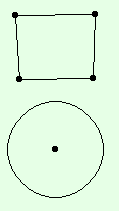

# Shape Editor

## Description
Shape Editor is a C++ project for a third year university subject Computer Graphics. The application allows to form polygons and circles on a canvas and to define constraints for those shapes (e.g. you can set two edges to have the same length). The project focused on rasterization and antialiasing algorithms, however the main difficult was implementing constraints system, because moving shape which has many constraints defined on it without breaking them can be a difficult task. The application uses Xiaolin Wu's algorithm for antialiasing and Bresenham's algorithm for drawing shapes without antialiasing.
## Defined constraints:
* A circle has fixed center position
* A circle has fixed radius
* An edge has fixed length
* Two edges have the same length
* Two edges are parallel
* An edge is tangent to a circle
## Antialiasing
Shapes without antialiasing   |  Shapes with antialiasing
:----------------------------:|:-----------------------------:
  |  
## Dependencies
The project uses SFML (Simple and Fast Multimedia Library) and its makefile makes use of a dynamic version of SFML libraries.
## Font
The font used in this project is Liberation Mono Regular.
